# Генератор траекторий мобильного объекта на полигоне

Реализация и сравнительный анализ алгоритмов семейства **Bug** (Bug0, Bug1, Bug2) для планирования траектории мобильного робота в двумерном пространстве с препятствиями.

## Описание

Алгоритмы семейства Bug — простые и эффективные методы планирования пути мобильного робота в неизвестной среде, использующие только локальную информацию об окружении (без построения полной карты). Робот движется к цели по прямой, а при встрече с препятствием переключается в режим обхода его границы.

В проекте реализованы три классических алгоритма:

- **Bug0** — движение к цели, при встрече препятствия — обход границы до тех пор, пока путь к цели снова не станет свободен.
- **Bug1** — полный обход препятствия с запоминанием точки, ближайшей к цели, возврат в эту точку и продолжение движения.
- **Bug2** — обход препятствия до пересечения с линией, соединяющей старт и цель (M-линия), после чего движение продолжается по ней.

Полигон задаётся как плоскость, ограниченная замкнутой ломаной линией, а препятствия — как статичные многоугольники внутри неё.

## Возможности

- Генерация траектории мобильного объекта на полигоне с произвольными препятствиями
- Обход препятствий по часовой стрелке и против часовой стрелки
- Визуализация процесса движения и итоговой траектории с помощью `matplotlib`
- Тестирование на нескольких сценариях: полигон без препятствий, с одним препятствием, с несколькими препятствиями, с узкими проходами

## Структура репозитория

```
.
├── bug0.py          # Реализация алгоритма Bug0
├── bug1.py          # Реализация алгоритма Bug1
├── bug2.py          # Реализация алгоритма Bug2
├── images/          # Скриншоты визуализации траекторий (1.png ... 16.png)
└── README.md
```

## Требования

- Python 3.8+
- `matplotlib`

Установка зависимостей:

```bash
pip install matplotlib
```

## Использование

Каждый алгоритм запускается отдельным скриптом:

```bash
python bug0.py
python bug1.py
python bug2.py
```

Внутри скрипта задаются:

- границы полигона и координаты препятствий;
- начальная и конечная точки маршрута;
- размер шага робота (`stepSize`) и его габариты (`robotSize`);
- направление обхода препятствий (`rotation`: `1` — по часовой стрелке, `-1` — против часовой стрелки).

После запуска на графике отображается процесс движения робота от начальной точки к цели с обходом препятствий.

## Основные методы

| Метод | Назначение |
|---|---|
| `find_nearest_side_index(point, path)` | находит индекс ближайшей стороны многоугольника к точке |
| `find_side_vector(side_index, path)` | вычисляет вектор направления заданной стороны многоугольника |
| `find_vector_to_nearest_side(point, path)` | возвращает направление движения вдоль ближайшей стороны многоугольника |
| `at_vertex(robot_pos, obstacle)` | проверяет, находится ли робот в вершине препятствия |
| `main()` | основной цикл: инициализация окружения, движение к цели, обход препятствий, визуализация |

## Тестирование

Алгоритмы протестированы на четырёх типах полигонов:

1. Простой полигон без препятствий
2. Полигон с одним препятствием
3. Полигон с несколькими препятствиями
4. Полигон с узкими проходами

### Результаты визуализации

**1. Простой полигон без препятствий**

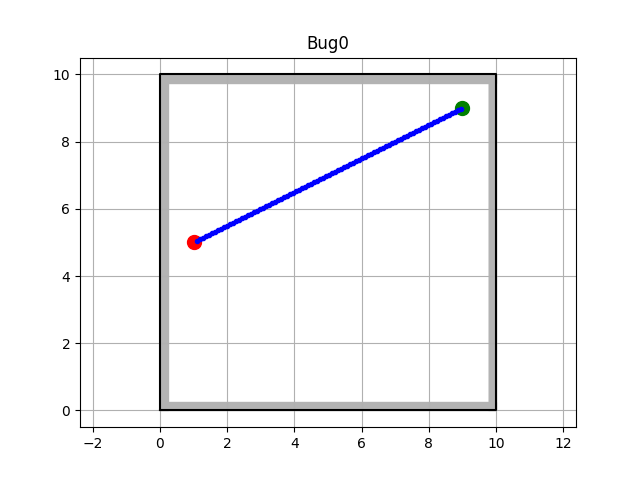

**2. Полигон с одним препятствием**

| Bug0 (вправо) | Bug0 (влево) |
|---|---|
| 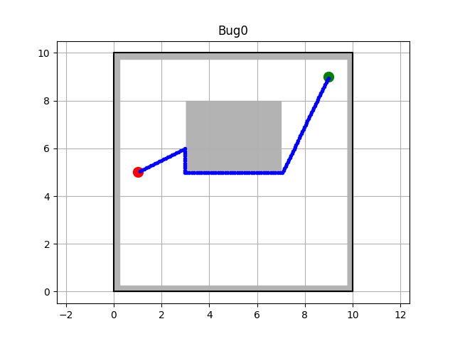 | 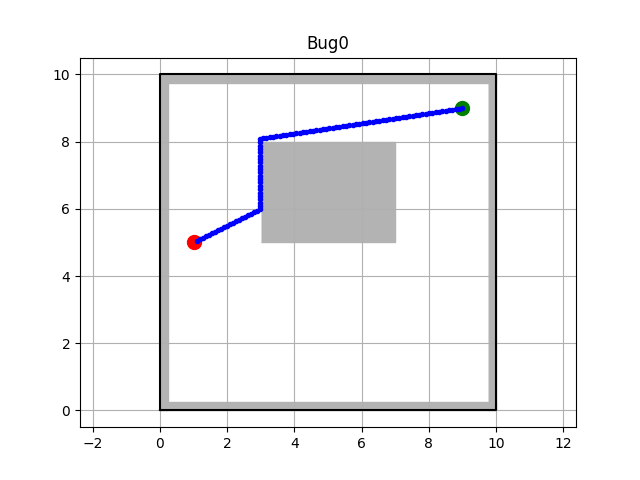 |

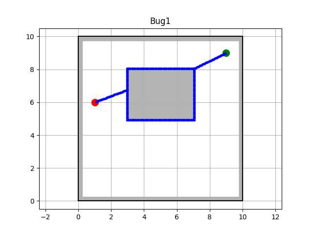

| Bug2 (вправо) | Bug2 (влево) |
|---|---|
| 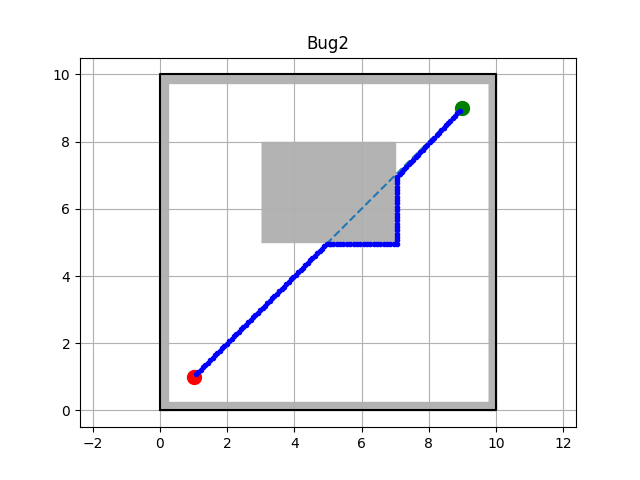 | 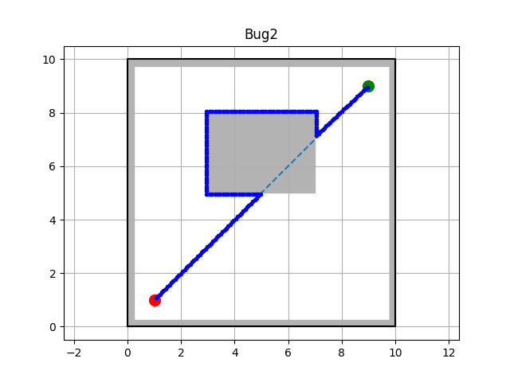 |

**3. Полигон с множеством препятствий**

| Bug0 (влево) | Bug0 (вправо) |
|---|---|
| 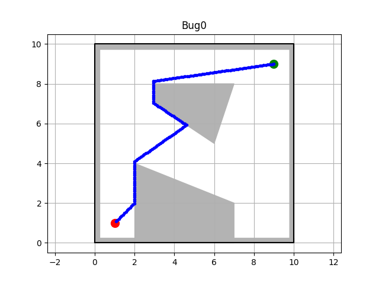 | 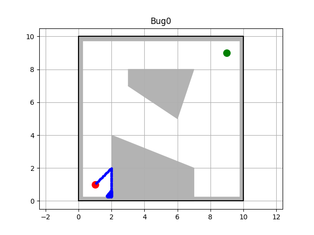 |

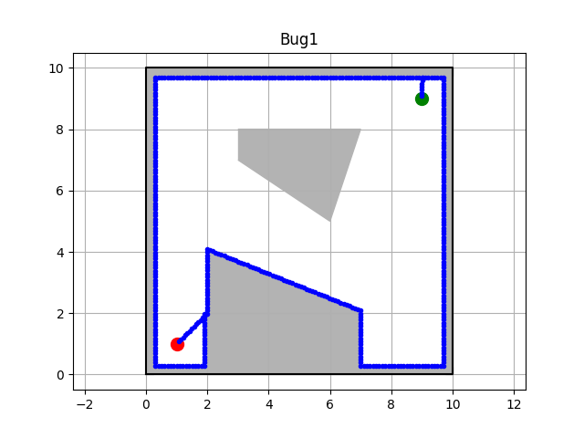

| Bug2 (вправо) | Bug2 (влево) |
|---|---|
| 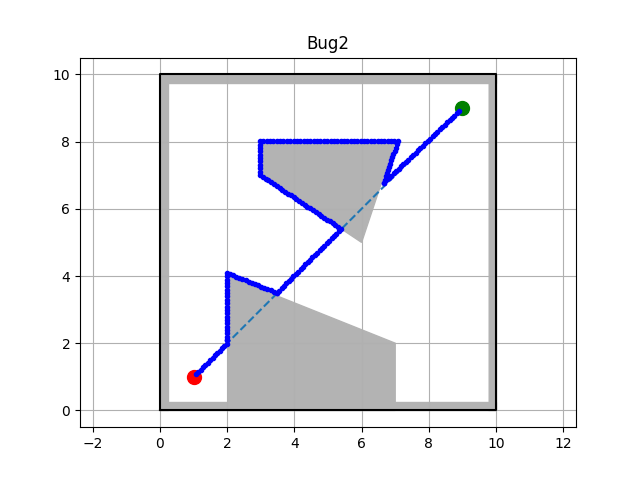 | 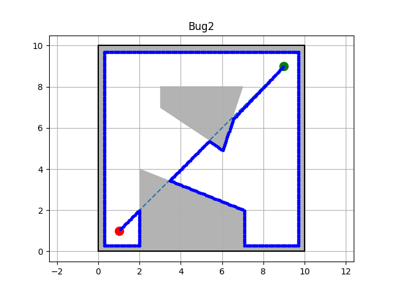 |

**4. Полигон с узкими проходами**

| Bug0 (вправо) | Bug0 (влево) |
|---|---|
| 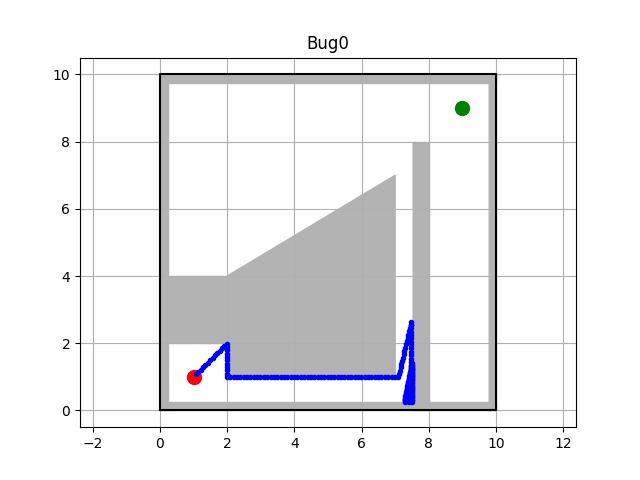 | 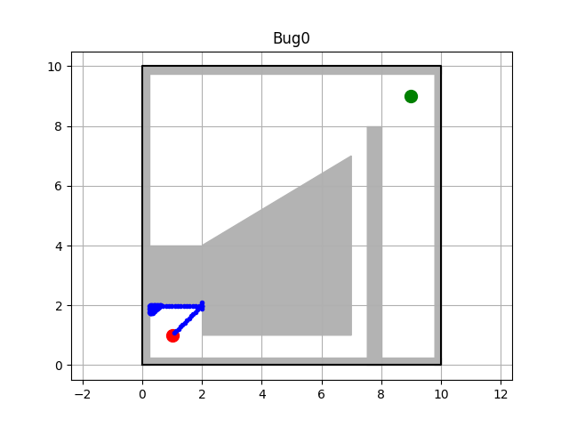 |

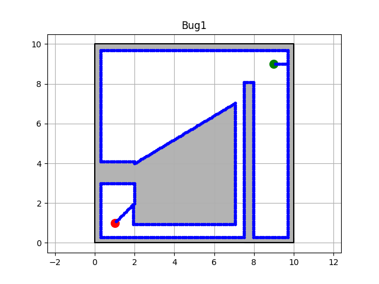

| Bug2 (вправо) | Bug2 (влево) |
|---|---|
| 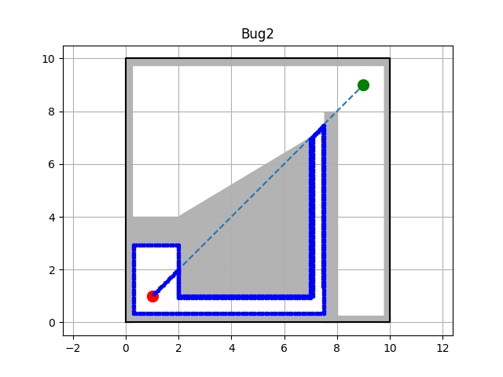 | 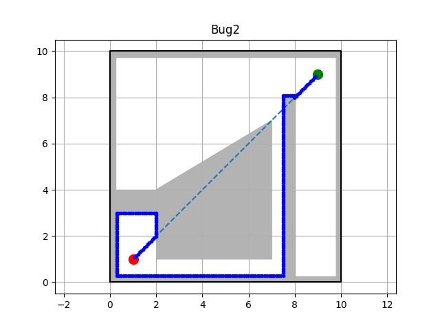 |

### Сравнение по критериям

Сравнение по критериям **эффективность**, **надёжность** (устойчивость к зацикливанию) и **потребление памяти**:

| Критерий | Bug0 | Bug1 | Bug2 |
|---|---|---|---|
| Эффективность | 1 | 3 | 2 |
| Надёжность | 3 | 1 | 2 |
| Потребление памяти | 1 | 3 | 2 |

*(1 — лучший результат, 3 — худший)*

**Выводы:** Bug0 работает быстрее всех благодаря простой логике, но подвержен риску зацикливания в сложных средах. Bug1 самый надёжный (зацикливание невозможно), но требует наибольшего объёма памяти и даёт более длинный путь из-за полного обхода препятствий. Bug2 занимает промежуточное положение по всем показателям.

## Планы по развитию

- Добавление эвристик для сокращения длины итоговой траектории
- Интеграция с другими методами планирования пути (например, потенциальными полями)
- Поддержка динамических препятствий

## Источники

1. V. Lumelsky, A. Stepanov. *Dynamic path planning for a mobile automaton with limited information on the environment*. IEEE Transactions on Automatic Control, 1986.
2. K. McGuire, G. Croon, K. Tuyls. *A Comparative Study of Bug Algorithms for Robot Navigation*. 2018.
3. Y. Zhu, T. Zhang, J. Song, X. Li. *A new Bug-type navigation algorithm for mobile robots*. IEEE ICRB, 2010.
4. S. Gupta, C. S. Asha, J. M. D'Souza. *Implementation and Comparison of BUG Algorithms on ROS*. INOCON, 2023.
5. Y. Zhu, Z. Tao, J. Song, X. Li. *A new bug-type navigation algorithm for mobile robots in unknown environments containing moving obstacles*. Industrial Robot, 2012.
6. K. McGuire et al. *Minimal navigation solution for a swarm of tiny flying robots to explore an unknown environment*. Science Robotics, 2019.
